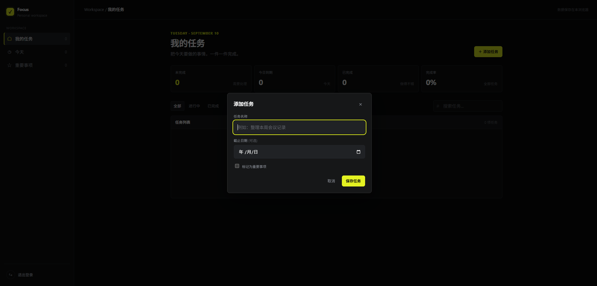
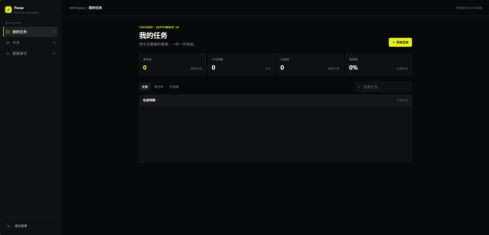
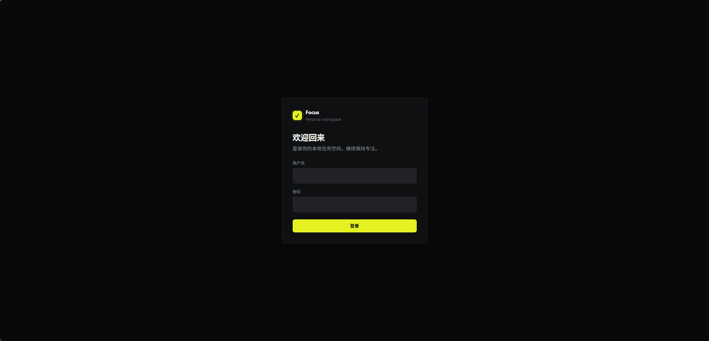
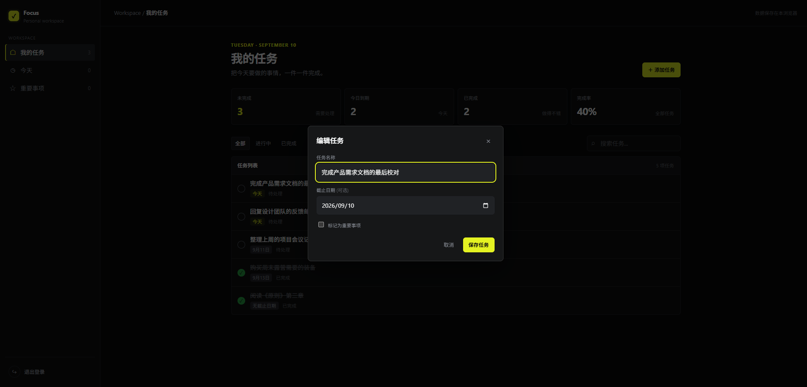
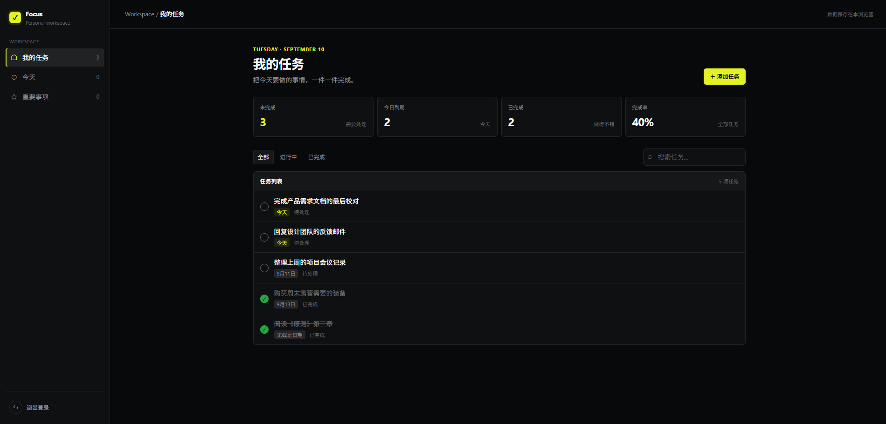

# 项目简介

这是一个前后端分离的待办事项项目，用于练习 Java Web 开发的完整流程。

## 当前实现范围
- 用户：注册、登录、修改密码。
- 任务：创建、查询、详情、更新、完成状态切换、删除。
- 权限：JWT 鉴权，用户只能访问自己的任务。

## 技术栈（以代码为准）
- 后端：Java 17、Spring Boot 4.1.1、Spring Security、Spring Data JPA、PostgreSQL、JWT。
- 前端：Vue 3、Vite、Vue Router、Pinia、Element Plus、Axios。

## 参考页面

