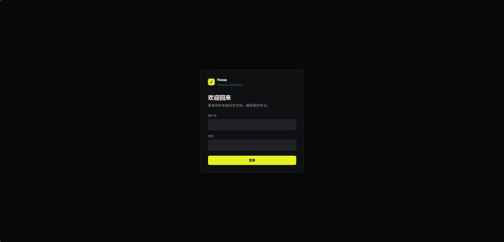
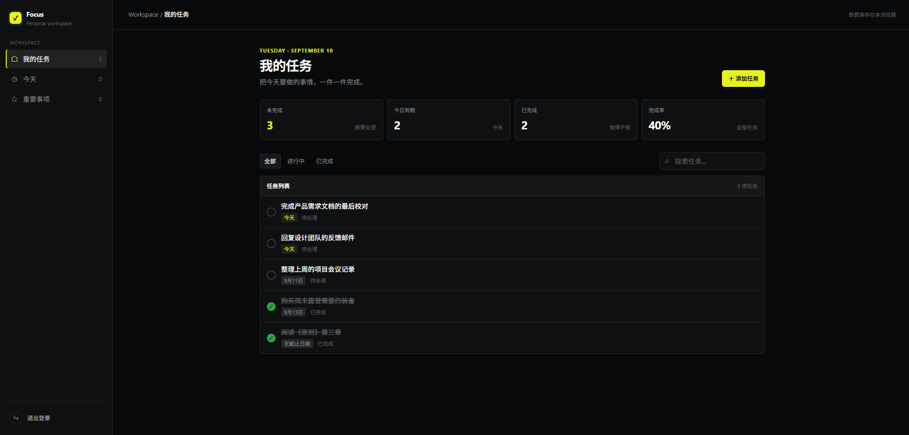
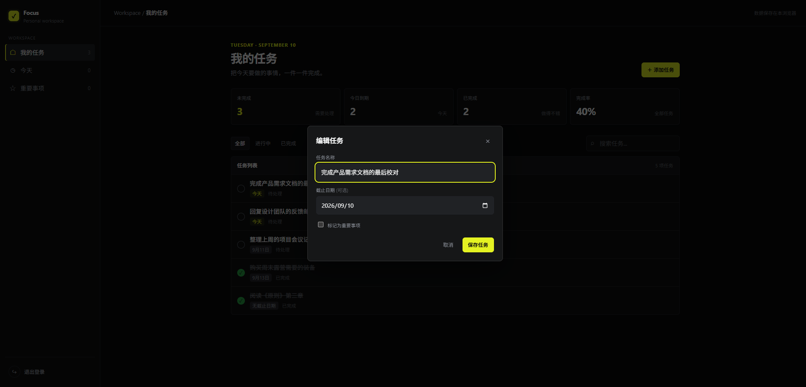

# 我的待办事项

## 1. 项目简介

开发一个前后端分离的待办事项管理系统。需要完成后端 RESTful API、前端管理界面、数据库设计、身份认证、权限控制和单元测试。

## 2. 技术栈清单

### 后端

- Java 21
- Spring Boot 3.x
- Spring MVC
- Spring Data JPA
- Spring Security
- JWT（JSON Web Token）
- Maven
- springdoc-openapi
- JUnit 5、Spring Boot Test

### 数据库

- PostgreSQL
- JPA/Hibernate 作为 ORM 实现

### 前端

- Vue 3
- Vite
- Vue Router
- Pinia
- Element Plus
- 使用 Axios （HTTP 客户端）调用后端 API

### 工程规范

- 接口风格：RESTful API
- 响应格式：统一 JSON 响应格式
- 版本管理：Git
- 部署：暂不要求部署

## 3. 版本和实现约束

1. 后端使用 Java 21，使用 Spring Boot 3。
2. 数据访问必须通过 Spring Data JPA 完成，不得在业务代码中直接拼接 SQL 作为主要实现方式。
3. 前端必须使用 Vue 3 和 Vite，不得提交仅由静态 HTML 拼接而成的页面替代 Vue 应用。
4. 登录、身份认证和接口权限校验必须由后端完成；前端路由守卫只能作为用户体验补充，不能代替后端鉴权。
5. 不要求 Docker、云服务器、微服务、Redis、消息队列或 CI/CD。

